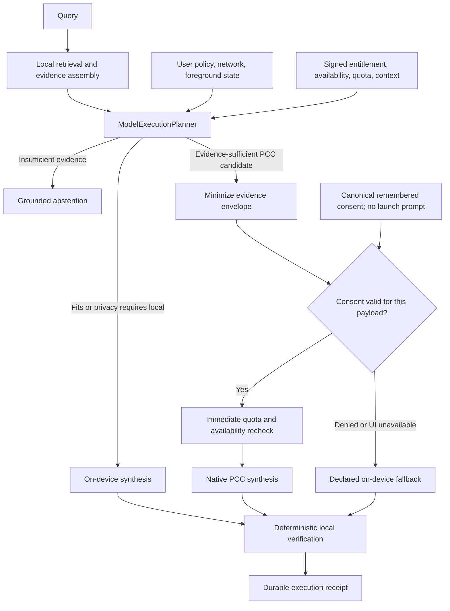

# Privacy and Model Routing — source-verified at v4.6, shipped tree is v5.0

> **Documentation status:** Source-verified on 2026-07-15 against v4.6. **Not re-verified since.** **iOS 5.1** and **macOS 5.1** are the shipped versions (both approved 2026-09-02, build 433); `Docs/SHIPPED_VERSION.json` is the per-platform record. Corrected 2026-09-01, having said 4.9 since July; 5.1 recorded 2026-09-02. Native PCC execution is owner-confirmed on a physical device (2026-07-28). Signed physical-device installation, Archive/TestFlight entitlement propagation, quota-exhaustion, network-transition, and background/App Intent validation remain pending.
> **Note on the routing picker:** until 2026-07-30 the stored routing policy did not govern Deep Think or Maximum, and an On-Device selection could still send a minimized envelope to PCC. Consent was never bypassed. Fixed in `6f29d2d`; see `Docs/CANONICAL_OPENINTELLIGENCE_SOURCE_OF_TRUTH.md` §8. If you are reading this document to answer a question about what a routing setting guaranteed *before* that date, the answer differs from what is described below.
> **Source of truth:** `Docs/CANONICAL_OPENINTELLIGENCE_SOURCE_OF_TRUTH.md` and the current implementation.

OpenIntelligence is local-first. Extraction, OCR, embeddings, vector and lexical retrieval, evidence scoring, route planning, transcript handling, and response verification run on the device. No document or query content is sent to a third-party AI provider. Apple Private Cloud Compute (PCC) is the only remote model target.

## Public execution targets

- **On-device:** `SystemLanguageModel.default` on supported Apple Intelligence devices.
- **Private Cloud Compute:** `FoundationModels.PrivateCloudComputeLanguageModel` on iOS/macOS 27+ when every capability and consent gate passes.

The public SDK does not expose separately selectable 3B, 20B, Advanced, or server parameter-count identities. OpenIntelligence therefore does not claim those models. iOS/macOS 26 is genuinely local-only; local generation is never labeled or simulated as PCC. `[evidence_level: compile_verified+code_verified, confidence: exact, evidence_source: FoundationModelSessionFactory.swift, EngineSDKCompatibility.swift]`

### Reasoning level is the only tier the public SDK offers, and it is PCC-only

Apple's own system UI on iOS 27 presents a model picker naming "Cloud" and "Cloud Pro". **Neither is reachable from a third-party app.** The public SDK declares exactly one server model class, `PrivateCloudComputeLanguageModel`, and no model-choice, tier, or variant type exists in any public framework. What third parties get instead is `ContextOptions.reasoningLevel`, new in iOS/macOS 27, whose cases are `.light`, `.moderate`, `.deep` and `.custom(String)`.

Apple's capability table states it directly: reasoning is **not supported** on-device and has **multiple levels** on PCC, alongside a 4K to 32K context increase. So the app sends a reasoning level only on the PCC route and never on-device, because the on-device model has no such knob; `GenerationOptions` carries only sampling, temperature, response tokens, and tool-calling mode.

`AppleFoundationModelRoute.reasoningLevel` is the single mapping from `PCCReasoningLevel` to Apple's enum, and `contextOptions(includeSchemaInPrompt:)` builds the value each call site passes. The parameter is not cosmetic: `ContextOptions` is a defaulted argument on **every** `respond` and `streamResponse` overload, so a call site that omits it silently runs at Apple's default effort rather than failing. Until 2026-09-10 one of the app's twenty-five generation call sites passed it, which meant Deep Think and Maximum advertised highest-effort reasoning and frequently did not request any. The streaming, continuation, structured and prose-fallback paths now all pass it.

`includeSchemaInPrompt` must be threaded rather than defaulted. The guided-generation overloads default it to `true` while the plain overloads leave it `nil`, and supplying any `ContextOptions` replaces that default wholesale, so handing a structured call a bare `ContextOptions(reasoningLevel:)` would quietly stop including the schema.

Auxiliary Foundation Models calls (HyDE, cluster labels, smart replies, suggested questions, contextual compression, tagging) deliberately send no reasoning level. They are internal utility generations, not the user's answer, and spending PCC reasoning quota on a cluster label is waste.

`[evidence_level: code_verified+build_verified, confidence: exact, evidence_source: FoundationModels.swiftinterface in the iOS 27 SDK (Xcode 27A5194q) — ContextOptions is @available(iOS 27.0, ...) with cases light/moderate/deep/custom, and is the only tier-like type across every public framework interface; https://developer.apple.com/documentation/foundationmodels/adding-server-side-intelligence-with-private-cloud-compute capability table, fetched 2026-09-10; Swift 6.4 build 2026-09-10 links ContextOptions symbols with a non-zero SystemLanguageModel control]`

## Post-retrieval decision flow

`QueryRuntimeCoordinator` preserves the user's policy but does not predict a final route. After retrieval, `ModelExecutionPlanner` evaluates:

- evidence sufficiency, score distribution, context size, and multi-document synthesis need;
- automatic, on-device-only, prefer-cloud, or cloud-only policy;
- network and foreground/background state;
- signed PCC entitlement, live availability, live quota, and SDK-reported context size;
- whether the app is foreground-interactive, **now on macOS as well**. That input gates cloud alongside remembered consent, and until 2026-08-11 it was computed inside `#if canImport(UIKit)` with the `#else` branch hardcoding `true`. A backgrounded Shortcut on a Mac therefore reported itself foreground-interactive and could reach PCC with nobody present to answer the consent sheet, which is the case the gate exists to prevent. macOS reads `NSApplication.shared.isActive` now, and a platform with no UI framework falls closed to `false`. `[evidence_level: code_verified+build_verified, confidence: exact, evidence_source: RAGService.swift makePostRetrievalModelPlan]`;
- exact SDK token counts where available, otherwise a receipt-labeled conservative estimate.

Escalation never substitutes for missing evidence. Weak or irrelevant retrieval abstains or stays local according to the grounding policy. `[evidence_level: code_verified, confidence: high, evidence_source: ModelExecutionPlanner.swift, FoundationModelTokenBudget.swift, RAGService.swift]`

### Correction: the policy did not reach Deep Think or Maximum before 2026-07-30

Recorded here because this document asserts the routing policy as a privacy guarantee, and for the agentic modes that assertion was not true.

`AgenticOrchestrator.generateWithProperConsent` constructed a fresh `InferenceConfig` from only `maxTokens`, `temperature`, and `systemPrompt`. `fmPreference`, `executionContext`, and `allowPrivateCloudCompute` therefore fell back to their defaults (`.automatic`, `.automatic`, `true`) even though `ChatScreen` had already assembled a config carrying the user's actual selection. The second bullet above — *"automatic, on-device-only, prefer-cloud, or cloud-only policy"* — was evaluated against a default, not against what the user chose.

Three physical-device runs, one per picker setting, were identical in routing. **With the picker on On-Device, a minimized evidence envelope of 16,642 bytes across 20 chunks was still sent to PCC, and the UI labeled it "(User Selected)".**

Scope, stated precisely:

- The consent gate was **not** bypassed. `consentState` is read independently of the picker, and `.denied` genuinely blocked PCC. The observed runs carried a remembered grant from a prior explicit allow.
- The destination was Apple PCC under the same minimization and entitlement gates described below. No third-party provider was involved, and no additional data left the device beyond the normal PCC envelope.
- What failed is narrower and still serious: **the picker and the `allowPrivateCloudCompute` setting did not restrict routing in the two modes that transmit the most.** A user who granted PCC consent once and later selected On-Device would not get on-device-only behavior.
- Standard was unaffected throughout. It consumes the `ChatScreen` config directly, derives `pccEligible` from those fields, and sizes packed context to match.

Fixed in `6f29d2d`. `RAGService` captures a `UserRoutingPreference` per query and applies it to the config before planning, so `allowsPCC` reflects the real selection. On-Device is absolute and covers final synthesis, not only the reasoning sessions. Query expansion and planning remain local under every setting by design.

`[evidence_level: device_verified_for_the_defect+build_verified+test_verified_for_the_fix, confidence: high_for_the_defect_unverified_on_device_for_the_fix, evidence_source: PCC/On-Device/Hybrid device logs 2026-07-30, ChatScreen.swift:2626, AgenticOrchestrator.swift, RAGService.swift]`

## Entitlement, OS, and quota gates

Apple approval of `com.apple.developer.private-cloud-compute` was confirmed by the user on 2026-07-15, and the source entitlement is enabled. Runtime evidence is platform-specific: native macOS uses Security.framework `SecTask`; iOS/Catalyst development and ad-hoc builds parse the embedded signed provisioning profile; App Store/TestFlight builds that omit that profile allow only the approved PCC key to continue to Apple's documented `PrivateCloudComputeLanguageModel.availability` and quota checks. The branch passes a generic arm64 iPhoneOS compile gate, while signed installation and distribution runtime validation remain pending. `[evidence_level: build_verified+sdk_verified+user_confirmed, confidence: high_for_source_unverified_for_distribution]`

Before PCC construction, the app verifies:

1. iOS/macOS 27 availability;
2. signed entitlement presence;
3. `PrivateCloudComputeLanguageModel` availability;
4. quota is not exhausted;
5. network and policy permit PCC;
6. the planned envelope fits the live context budget.

Quota is rechecked immediately before the model is constructed. A quota failure is not retried on PCC. Unknown future SDK quota states map to `.unknown` through Swift's `@unknown default` handling and therefore do not authorize PCC.

**Corrected 2026-08-11. That last sentence was true of the mapping and false of the consequence, for as long as it has been written here.** `FoundationModelCapabilitySnapshot.canUsePCC` tested `pccQuota != .limitReached` alone, so `.unknown` authorized a cloud attempt. Three places already asserted the opposite: this paragraph, `RouteEvalMetrics.RouteInvariant.quotaFailClosed` ("`.limitReached`, `.unsupported`, and `.unknown` are all fail-closed states"), and `ModelExecutionReceipt.nonAuthorizingQuotaStates`. Only the planner disagreed, and it is the one that decides. The rule now exists once as `PCCQuotaState.authorizesCloudExecution`, exhaustive over the enum, and both the planner and the scorer derive from it. Found by reconciling the roadmap against code; no test covered this path, and `PCCQuotaAuthorizationTests` covers it now. `[evidence_level: code_verified+test_verified, confidence: exact, evidence_source: ModelExecutionPlan.swift PCCQuotaState.authorizesCloudExecution and canUsePCC, RouteEvalMetrics.swift]` Hybrid and explicit PCC policy use the declared local fallback before meaningful streaming; the receipt retains PCC as intended and on-device as completed. `[evidence_level: code_verified+user_confirmed, confidence: high_for_source_unverified_for_distribution, evidence_source: FoundationModelCapabilityProvider.swift, FoundationModelSessionFactory.swift, ModelExecutionPlanner.swift, LLMService.swift, OpenIntelligence.entitlements]`

## Evidence minimization and consent

PCC consent happens only after the route and cloud evidence envelope are final. `CloudEvidenceMinimizer` selects a bounded set of source IDs, names, page numbers, and text. The consent sheet displays provider/model, prompt size, context size, chunk count, total estimated bytes, and the machine-readable route reason.

- **Allow once:** grants the current in-process PCC provider session.
- **Always allow:** persists provider consent; each transmission still produces a local record.
- **Deny:** blocks PCC. Hybrid and explicit PCC policy use the on-device fallback and label the answer accordingly.

Background and App Intent execution never waits for a foreground consent sheet. Remembered consent may permit PCC; otherwise Hybrid and explicit PCC policy complete through the declared on-device fallback. `[evidence_level: code_verified, confidence: high, evidence_source: RAGService.swift, CloudConsentPromptView.swift, AgenticOrchestrator.swift]`

`cloudConsent.applePCC` is the canonical remembered value. On upgrade, the legacy PCC picker is synchronized to that value; it cannot erase an explicit allow/deny decision. Selecting Ask removes the canonical decision. App launch loads consent state but does not pre-create a transmission record or present the sheet, so a prompt is tied only to a real finalized post-retrieval envelope. `[evidence_level: code_verified+test_verified, confidence: high_pending_physical_device_validation, evidence_source: SettingsStore.swift, RAGService.swift, PCCConsentPreferenceMigrationTests.swift]`

## Fallback and stream integrity

- PCC may fall back to on-device only before meaningful response text has streamed.
- Once a meaningful partial response exists, OpenIntelligence returns that single-target partial response rather than mixing cloud and local output.
- PCC is not automatically retried after quota failure.
- Intermediate Deep Think/Maximum reasoning sessions stay on-device; only final post-retrieval synthesis may be selected for PCC.
- Retrieval evidence and citation verification remain local even when synthesis uses PCC.

`[evidence_level: code_verified, confidence: high, evidence_source: RAGService.generateWithFallback, AgenticOrchestrator.generateWithFreshSession]`

## Route telemetry

`ModelExecutionReceipt` is the durable route truth. It records plan/policy IDs, timestamps, reason codes, intended target, attempts, actual target, fallback reason, completed target, quota category, and verification result. `ResponseMetadata.executionRoute` is a compatibility summary derived from the completed receipt.

Telemetry may include identifiers, public target names, counts, budgets, hashes, quota categories, reason codes, and verification status. It must not include raw query text, document text, transcript content, or generated reasoning. Historical responses remain readable because receipt metadata is optional. `[evidence_level: code_verified, confidence: high, evidence_source: ModelExecutionReceipt.swift, RAGQuery.swift, LLMService.swift]`

## Validation boundary

The source implementation and Swift parsing are complete. Production readiness is not yet claimed until the following pass on a signed iOS 27 device and distribution artifact: entitlement inspection, native PCC execution, intended-versus-actual receipt confirmation, consent allow/deny/revoke, App Intent/background behavior, quota approach/exhaustion, offline and mid-request network changes, and physical-device thermal/battery checks. `[evidence_level: code_verified, confidence: exact_for_unverified_status, evidence_source: PCC dynamic routing test matrix]`
